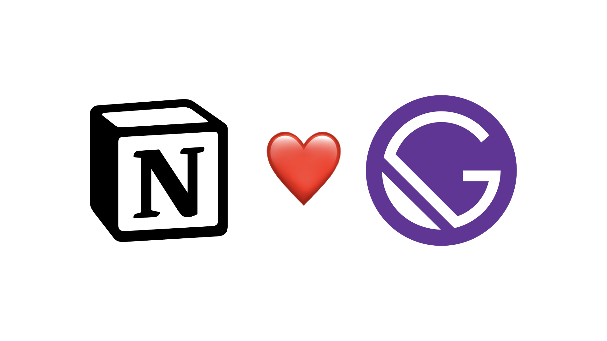

# Notion2Gatsby

> Disclaimer : This repository is forked from [Arnaud's repo](https://github.com/ArnaudValensi/ArnaudValensi.github.io). His repo is not being maintained, so I modified some codes to make it work.



Notion2Gatsby is a convenient tool to transform your notion pages to fancy Gatsby site.

- Because it is in very early development, so I welcome any kind of suggestion and feature requests.

[Demo](https://indosaram.github.io/notion2gatsby/)

## Setup

### Install dependencies

You need a Github account, and attach your SSH key to the account, if you want Notion2Gatsby automatically setup your new repo for hosting Github pages.

A command below will install Github CLI and make you login to Github via CLI. After that, interactive shell will prompt you to generate a new repo for your Notion2Gatsby.

```bash
bash ./install.sh
```

### Setup `params.json` file

In the root of the repo, you will find `example.json`. Copy this file and rename as `params.json`, as Notion2Gatsby takes this filename as a default. A structure of this file is as below:

```json
{
  "template_repo": "https://github.com/Indosaram/notion2gatsby.git",
  "blog_title": "MY BLOG",
  "description": "THIS IS MY BLOG",
  "author": "TEST",
  "github_username": "MY_USERNAME",
  "target_dir": "/Users/indo/code",
  "notion_user_id": "example@exmple.com",
  "notion_token": "MY_NOTION_TOKEN",
  "notion_root_url": "https://www.notion.so/MY_PAGE_URL",
  "google_analytics": "U-XXX",
  "google_adsense": "ca-pub-xx"
}
```

| Name             | Description                                                                                           | Required |
| ---------------- | ----------------------------------------------------------------------------------------------------- | -------- |
| template_repo    | A url of template repository.                                                                         | \*       |
| blog_title       | A title of your blog, and the repository name. All whitespace will be converted with `_`.             | \*       |
| description      | A short description of your blog                                                                      |          |
| author           | Author name                                                                                           |          |
| github_username  | Github username. i.e. Indosaram (Not email address)                                                   | \*       |
| target_dir       | A directory to clone the template repository. You may modify this entry according to your OS running. | \*       |
| notion_user_id   | NOT USED                                                                                              |          |
| notion_token     | A secret token to grant Notion2Gatsby access permission to your notion page.                          | \*       |
| notion_root_url  | A url of root page                                                                                    | \*       |
| google_analytics | Google analytics identifier                                                                           |          |
| google_adsense   | Google adsense identifier                                                                             |          |

If an entry is not marked as 'required', you don't have to fill up that entry. However, you should leave it as it is! Do not delete the entry.

To get your notion token, please refer [this](https://www.redgregory.com/notion/2020/6/15/9zuzav95gwzwewdu1dspweqbv481s5) page.

### Setup Notion page

You should make a page structure as following:

```
root
├──article
├──article
...
```


From root page, Notion2Gatsby will read subpages accordingly. Next, you must share your page via web. Notion2Gatsby only requires read-only permission.

### (Optional) Create a repository

You can always host this Gatsby template on your own repo. However, If you want Notion2Gatsby handle creating a repository for you, then run-

```bash
bash ./run.sh
```

It will setup;

- a clean repository with gatsby template.
- a script which will trasform your notion pages to posts.
- Github secrets to access your notion

Now go to the repo created, then you can see your blog running in shortly.

## Writing your articles

Before continue, you may want to refer [Markdown style preview](https://indosaram.github.io/notion2gatsby/blog/markdown-style-preview/) page, so you can choose what components from Notion to use.

### Cover image

Notion2Gatsby requires an article having a cover image. If an article does not have one, build stage will fail.

### H1 tag

`<h1>` tag is reserved for page title. Search engine bots will find this tag as a page title, so it is highly recommended to avoid using this tag other than the title. In addition, if you use `<h1>` tag, because a table of contents(toc) will include only from `<h2>` to `<h3>`, the strucutre will be ruined.

## Development

This repo assumes Python version equals to 3.8, but you can try it with your own python version. (I've only tested Python 3.7~3.9) If so, you may want to edit `Pipfile`'s `python_version` entry with your python version.

### To run locally

WIP
